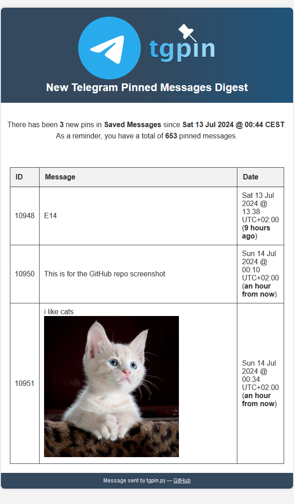

# tgpin

<p align="center">
  
</p>

**tgpin** is a Python tool used to notify you about new or existing pins in a Telegram channel by email.

# Why?

While it is not its main purpose, Telegram is great to store various types of content (text, images, files, etc.) thanks to its unlimited storage. In particular, the "Saved Messages" personal channel can be used to jot down notes, save links, or store files, and then retrieve that content easily on any other device Telegram is installed on.

Pinning messages can be used to highlight important content or create a quick reminder easily. However, it's easy to forget this information if you don't think about checking the channel regularly. Plus, the more pinned messages you have, the harder it is to keep track of them.

tgpin aims at solving this problem by sending an email with your most recent pinned messages so that you can take care of them all at once. Plus, you can also get reminders about old, existing pins that you might have forgotten about, which is perfect if you want to avoid being overwhelmed by the number of pinned messages.

# Installation

`git clone https://github.com/spidersouris/tgpin.git`

`cd tgpin`

`pip install --user -r requirements.txt`

One of the most common ways to use tgpin is to set up [a cron job](https://crontab.guru/) (Linux) or [a scheduled task](https://learn.microsoft.com/en-us/windows/win32/taskschd/task-scheduler-start-page) (Windows: <kbd>Win</kbd> + <kbd>R</kbd> -> `taskschd.msc`) that runs the script at regular intervals with `python tgpin.py`.

# Configuration

Most of the configuration is done in the `config/config-example.ini` file. Below is a list of the required and optional configuration options.

## Required configuration

### Telegram API ID and Hash

To use tgpin, you need to create an application on the [Telegram website](https://my.telegram.org/apps). This will give you an API ID and Hash that must be specified in the `config/config-example.ini` file.

```ini
[telegram]

api_id = xxx
api_hash = xxx
```

### Email

To receive email notifications, make sure to configure `config/config-example.ini` to specify the SMTP server, port, and credentials of the email address used to send and receive the emails.

```ini
[email]

address = xxx
password = xxx
host = xxx
port = xxx
```

### Phone number

The first time you run the script, you will be asked to enter your phone number by [Telethon](https://tl.telethon.dev/). Then, you will receive a code in Telegram that you need to enter in the console. This is done to authenticate you with Telegram.

## Optional configuration

Optional configuration options are available and documented in the `config/config-example.ini` file.

# Screenshot

Below is a preview of the email notification for new pins:

<p align="center">
  
</p>
